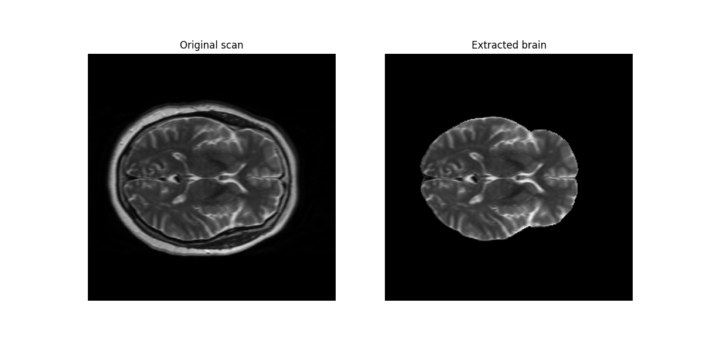

This program is designed to process MRI files (nii.gz) using the **HD-BET** library (Isensee et al. 2019). The program is part of the project _Synthetic Data Generation for MRI Brain Tissue Segmentation: An Evaluation of Model Robustness and Generalization_, and constitutes the component responsible for pre-processing the MRI files.

# Table of contents
1. About the program
2. How to execute
3. Steps to execute main.py
4. Output
5. References

# 1. About the package

The contents of this directory are the following:
* File `main_py`, which executes the program.
* File `skull_stripping.py`, the brain extrction module.
* File `requirements.txt`, contains libraries needed to execute the program.
* File `README.md`, contains information about the program and how to execute it.

# 2. How to execute
Before executing the program, be sure to install the necessary libraries from `requirements.txt`.

``pip install -r requirements.txt``

# 3. Steps to execute main.py
To execute this program, the `main.py` file should be called specifying the following arguments:
* `input_path`: a path to the folder contiaining the different subject directories.

```python main.py --input_path```

# 4. Output
Running this program will output several strings providing information about the image processing process.
When finished running, each folder containing a nii.gz file should include a new file containing the file generated by HD-BET.


```bash

SUBJECTS_DIR/

└── <subjectID>/
  ├── anat1/
  │   ├── t1w.nii.gz             # Original file
  │   └── t1w_stripped.nii.gz   # Extracted brain
  └── ...

```

See the comparison between the original scan and the processed image.



# 5. References
Isensee F, Schell M, Tursunova I, Brugnara G, Bonekamp D, Neuberger U, Wick A, Schlemmer HP, Heiland S, Wick W, Bendszus M, Maier-Hein KH, Kickingereder P. Automated brain extraction of multi-sequence MRI using artificial neural networks. _Hum Brain Mapp. 2019; 1–13._ https://doi.org/10.1002/hbm.24750

