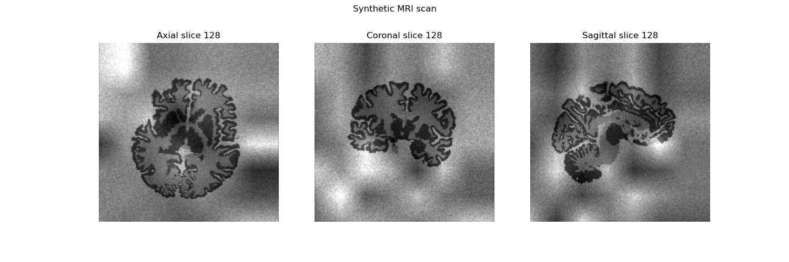
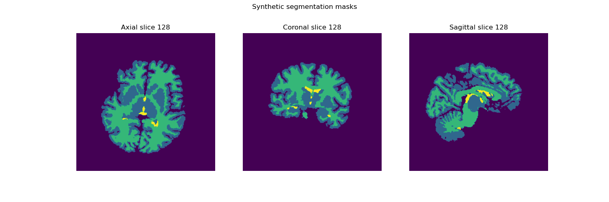

This package contains a program designed to generate synthetic MRI images and segmentation masks, primarily using the **lab2im** library (Billot et al. 2020). The program is part of the project _Synthetic Data Generation for MRI Brain Tissue Segmentation: An Evaluation of Model Robustness and Generalization_, and constitutes the component responsible for creating the synthetic training dataset.

# Table of contents
1. About the package
2. How to execute the program
3. Steps to execute main.py
4. Output
5. References

# 1. About the package
The contents of the package are the following:
* File `main_py`, which executes the program.
* File `preprocessing_masks.py`, the preprocessing module.
* File `image_generation.py`, the MRI and segmentation masks generation module.
* File `requirements.txt`, contains libraries needed to execute the program.
* File `README.md`, contains information about the program and how to execute it.

# 2. How to execute the program
Before executing the program, be sure to install the necessary libraries from `requirements.txt`. It is recommended to create a new python 3.7.1 environment to avoid compatibility problems.

``pip install -r requirements.txt``

# 3. Steps to execute main.py
To execute this program, the `main.py` file should be called specifying the following arguments:

* freesufer_directory: a default Freesurfer directory, that is, a directory with a folder for each subject and its files.
* file_output: a directory where the synthetic images will be generated. It should not be stored inside the Freesurfer directory
* n_examples: the number of images to be generated per segmentation mask.

```python main.py --freesurfer_directory --file_output --n_examples```

# 4. Output
Running this program will output several strings providing information about the image generation process.
When finished running, a default Freesurfer directory should include the `processed_mask.nii.gz` file in the `mri` folder for each subject in the specified directory:

```bash
SUBJECTS_DIR/
└── <subjectID>/
    ├── mri/
    │   ├── orig/
    │   ├── transforms/
    │   ├── aparc+aseg.mgz          # File used for mask preprocessing
    │   ├── ...
    │   └── processed_mask.nii.gz   # Processed mask
    └── ...
```
While the chosen directory to host the generated images should present a directory per subject, with as many synthetic brain scans and segmentation masks as specified during code execution:
```bash
SYNTH_IMAGES_DIR/
├── <subject_1_synth>/
│   ├── brain_1.nii.gz
│   ├── brain_2.nii.gz
│   ├── ...
│   ├── brain_n.nii.gz 
│   ├── labels_1.nii.gz
│   ├── labels_2.nii.gz
│   ├── ...
│   └── labels_n.nii.gz
├── <subject_2_synth>/
│   ├── brain_1.nii.gz
│   ├── brain_2.nii.gz
│   ├── ...
│   ├── brain_n.nii.gz 
│   ├── labels_1.nii.gz
│   ├── labels_2.nii.gz
│   ├── ...
│   └── labels_n.nii.gz
│
├── ...
│
└── <subject_n_synth>
    └── ...
```
See two examples of synthetic MRI scans and segmentation masks generated with this program:




# 5. References
Billot, B., Greve, D., Van Leemput, K., Fischl, B., Iglesias, J.E. and Dalca, A.V., 2020. A learning strategy for contrast-agnostic MRI segmentation. _arXiv preprint arXiv:2003.01995_.
